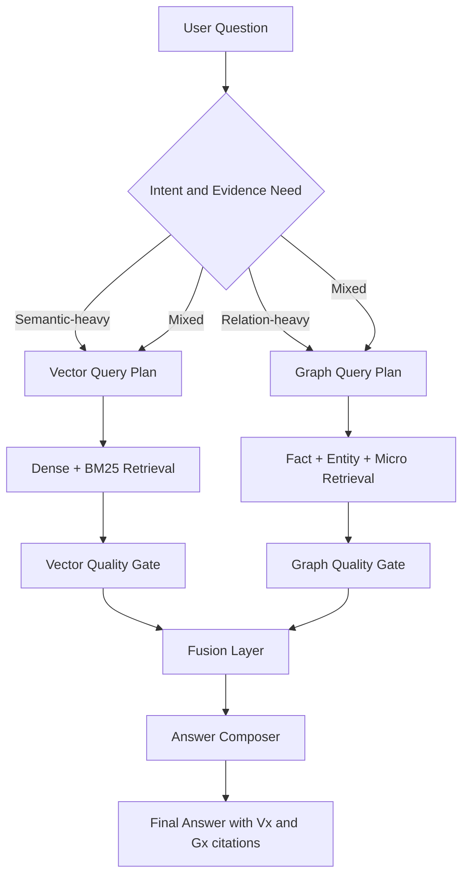
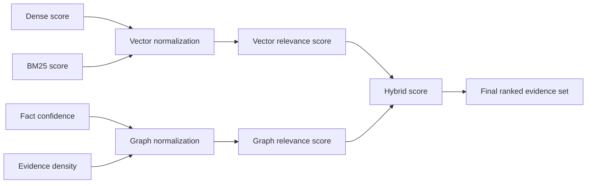
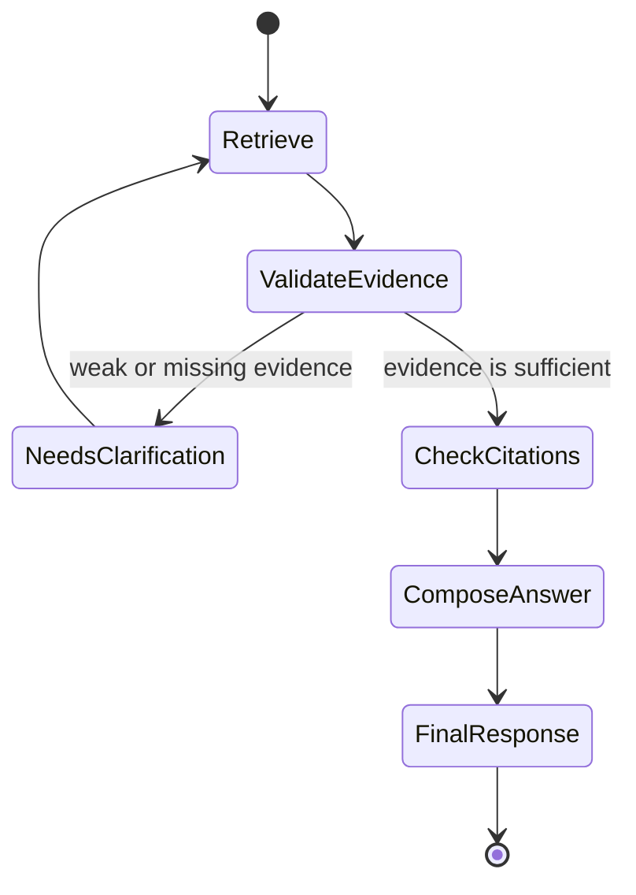
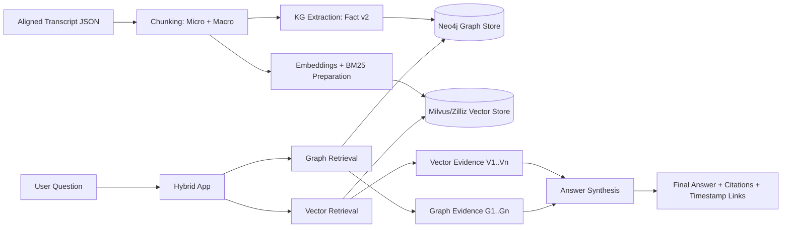
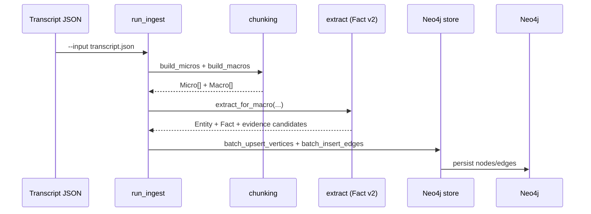
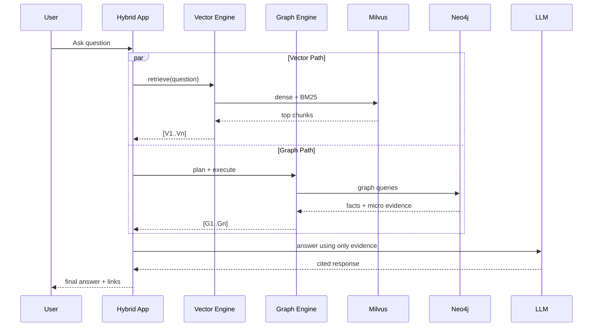
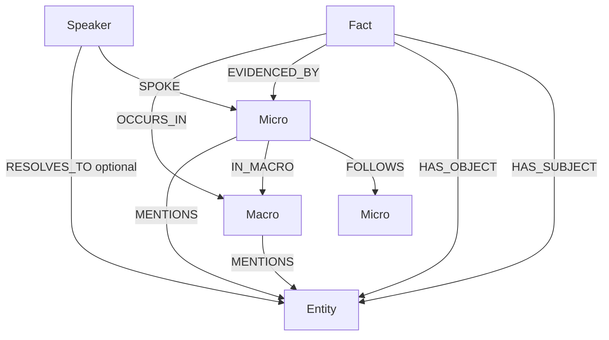

# :satellite: PodKG Hybrid

Evidence-first Hybrid RAG for long-form podcast and YouTube transcripts.

PodKG Hybrid combines:

- :mag: **Vector Retrieval** (dense + BM25) for high-recall semantic search.
- :link: **Graph Retrieval** (facts, entities, evidence links) for relational precision.
- :bookmark_tabs: **Citation-anchored Answers** with timestamped evidence.

This project is designed for one core outcome:
**answers that are useful, explainable, and traceable to primary transcript evidence.**

## :map: Quick Navigation

- Why We Built This
- Why Graph RAG Matters
- Retrieval Strategy (Router + Fusion)
- Ranking and Evidence Fusion
- Trust Pipeline
- System Architecture
- Example Questions
- Configuration
- Run the Pipelines

---

## :compass: Why We Built This

Most transcript assistants fail when questions become multi-hop, comparative, or evidence-heavy.

Typical failure patterns:

- They return semantically similar text, but not the exact claim source.
- They blend statements from different episodes without explicit grounding.
- They cannot reliably answer: *"Why should I trust this answer?"*

PodKG Hybrid addresses this with a strict evidence contract and a dual-retrieval architecture:

- **Vector path** to quickly find semantically relevant context.
- **Graph path** to retrieve explicit facts and their linked micro-evidence.
- **Hybrid synthesis** to produce one final answer with references (`[Vx]`, `[Gx]`).

---

## :brain: Why Graph RAG Matters (and Why Hybrid Wins)

| Capability | Vector-only RAG | Graph-only RAG | PodKG Hybrid |
|---|---|---|---|
| Semantic recall | Strong | Medium | Strong |
| Relation/fact tracing | Weak | Strong | Strong |
| Multi-hop reasoning | Medium | Strong | Strong |
| Explainability | Medium | Strong | Strong |
| Robustness to wording variation | Strong | Medium | Strong |
| Citation quality | Medium | Strong | Strong |

**Key point:** Vector retrieval finds *similar content*; Graph retrieval verifies *structured meaning and evidence links*. Hybrid gives both.

---

## :triangular_flag_on_post: Retrieval Strategy (Router + Fusion)

PodKG Hybrid is built as a **parallel retrieval system** with an evidence-aware fusion stage.
It does not force every question into one retrieval style.



Why this matters:

- Pure semantic questions stay fast.
- Relational/causal questions get fact-structured support.
- Mixed questions get both evidence channels instead of one weak compromise.

---

## :bar_chart: Ranking and Evidence Fusion

Vector and graph evidence are ranked separately, normalized, then merged.



A practical mental model:

- `vector_score` captures semantic proximity.
- `graph_score` captures claim structure and evidence connectivity.
- `hybrid_score` prioritizes both relevance and traceability.

---

## :shield: Trust Pipeline (Evidence-First Guardrails)

The system is designed to fail safely when evidence is weak.



This prevents high-confidence answers without high-quality grounding.

---

## :sparkles: System At A Glance



---

## :construction: Ingest Pipeline (Data -> Knowledge)



---

## :left_right_arrow: Query Path (How Answers Are Produced)



---

## :triangular_ruler: Graph Model (Fact v2)



---

## :lock: Evidence Contract

The final answer layer is constrained by design:

- Claims must come from retrieved evidence only.
- Vector citations are labeled as `[V1]`, `[V2]`, ...
- Graph citations are labeled as `[G1]`, `[G2]`, ...
- Timestamp links are included whenever a source can be mapped to YouTube time.
- The system is optimized for *auditable answers*, not generic chat fluency.

---

## :receipt: Example Answer Shape

Below is the target response style for production usage:

```text
Creatine is described as useful primarily for high-intensity output and muscle retention, with caveats around context and dosing [V2][G1].
One speaker frames it as "high upside, low downside" when paired with training consistency [V4].
A related fact path links creatine -> performance support -> training adaptation, evidenced by two micro segments in separate episodes [G2][G3].

Sources:
[V2] https://www.youtube.com/watch?v=...&t=812s
[V4] https://www.youtube.com/watch?v=...&t=1042s
[G1] https://www.youtube.com/watch?v=...&t=799s
[G2] https://www.youtube.com/watch?v=...&t=2311s
[G3] https://www.youtube.com/watch?v=...&t=2448s
```

---

## :question: Example Questions (From Basic to Deep)

### Basic factual queries

- "What does Peter Attia say about creatine?"
- "Who mentions zone-2 training most often?"

### Evidence-focused queries

- "Which exact transcript evidence supports this claim?"
- "Show all sources where this statement appears, with timestamps."

### Deep relational queries

- "Across episodes, where does speaker A agree with speaker B on insulin sensitivity?"
- "Find potentially conflicting claims about protein intake thresholds across different years."
- "Which entities are most frequently connected to longevity in fact-level evidence?"
- "When discussing topic X, which speaker changes stance over time?"

### Multi-hop reasoning prompts

- "What intervention is recommended, by whom, under which conditions, and with what caveats?"
- "Map the chain from concept -> mechanism -> practical action using only graph-backed facts."

### Cross-episode synthesis prompts

- "How did the view on topic X evolve between early and recent episodes?"
- "List claims that repeat across episodes and claims that directly conflict."
- "Which recommendations are stable across speakers, and which are speaker-specific?"

### Audit and verification prompts

- "For each key claim, return supporting and opposing evidence with timestamps."
- "Which part of the answer is weakly supported and needs more evidence?"
- "Show only facts with at least two independent evidence segments."

---

## :package: Repository Layout

| Path | Purpose |
|---|---|
| `podkg_hybrid/ingest/run_ingest.py` | Graph/KG ingest pipeline (Transcript -> Chunking -> KG -> Neo4j) |
| `podkg_hybrid/ingest/ingest_transcripts_to_milvus.py` | Vector ingest pipeline (Chunking -> Embedding/BM25 -> Milvus) |
| `podkg_hybrid/hybrid/app.py` | Main hybrid retrieval UI logic |
| `podkg_hybrid/apps/vector_app.py` | Standalone vector retrieval Streamlit app |
| `podkg_hybrid/apps/neo4japp.py` | Standalone graph retrieval Streamlit app |
| `podkg_hybrid/kg/chunking.py` | Micro/Macro chunk construction |
| `podkg_hybrid/kg/extract.py` | Fact extraction (Fact v2) |
| `podkg_hybrid/kg/store.py` | Neo4j upsert and edge insertion |
| `podkg_hybrid/core/config.py` | Ingest/runtime configuration |
| `podkg_hybrid/core/log_utils.py` | Structured logging helpers |
| `podkg_hybrid/core/llm_client.py` | LLM client for KG extraction |
| `podkg_hybrid/core/transcript_io.py` | Transcript parsing/loading utilities |
| `podkg_hybrid/docs/` | Project docs and supporting materials |

---

## :gear: Prerequisites

- Python 3.11+ (recommended)
- Neo4j (local or Aura)
- Milvus or Zilliz
- OpenRouter API key

---

## :inbox_tray: Installation

From repository root:

```bash
pip install -r requirements.txt
```

Alternative:

```bash
pip install -r podkg_hybrid/requirements.txt
```

---

## :control_knobs: Configuration

### 1) Ingest environment (`.env`)

```env
# Neo4j
NEO4J_URI=bolt://localhost:7687
NEO4J_USERNAME=neo4j
NEO4J_PASSWORD=your_password
NEO4J_DATABASE=neo4j

# LLM for KG extraction
LLM_BASE_URL=https://openrouter.ai/api/v1
LLM_API_KEY=your_openrouter_key
LLM_MODEL=deepseek/deepseek-v3.2

# Vector ingest
MILVUS_URI=http://localhost:19530
MILVUS_TOKEN=
COLLECTION_NAME=youtube_transcripts
OPENROUTER_API_KEY=your_openrouter_key
OPENROUTER_MODEL=qwen/qwen3-embedding-8b

# Recommended portability settings
TRANSCRIPT_DIR=transcripts_aligned_2
INDEX_JSON_PATH=transcript/index.json

# Optional KG toggles
KG_SPEAKER_BRIDGE=1
KG_VERIFY=0
KG_MICRO_MENTIONS=0
```

Notes:

- `podkg_hybrid/ingest/run_ingest.py` loads `.env` via `podkg_hybrid/core/config.py`.
- `podkg_hybrid/ingest/ingest_transcripts_to_milvus.py` reads env directly; ensure variables are exported in the running process.
- Fact model is enforced as **v2** (`KG_FACT_MODEL_VERSION=2`).

### 2) Streamlit secrets (`.streamlit/secrets.toml`)

The hybrid app consumes secrets from `st.secrets`.

```toml
# OpenRouter
OPENROUTER_API_KEY = "your_openrouter_key"
OPENROUTER_BASE_URL = "https://openrouter.ai/api/v1"
OPENROUTER_MODEL = "google/gemini-3-flash-preview"
OPENROUTER_CHAT_MODEL = "google/gemini-3-flash-preview"
OPENROUTER_JUDGE_MODEL = "google/gemini-3-flash-preview"
OPENROUTER_EMBED_MODEL = "qwen/qwen3-embedding-8b"

# Milvus / Zilliz
MILVUS_URI = "http://localhost:19530"
MILVUS_TOKEN = ""
COLLECTION_NAME = "youtube_transcripts"

# Neo4j
NEO4J_URI = "bolt://localhost:7687"
NEO4J_USERNAME = "neo4j"
NEO4J_PASSWORD = "your_password"
NEO4J_DATABASE = "neo4j"
```

---

## :bookmark: Input Transcript Format

The ingest pipeline expects a JSON array where each item has speaker, text, and timing:

```json
[
  {
    "speaker": "Speaker 1",
    "text": "We built this pipeline to make answers verifiable.",
    "start": 12.4,
    "duration": 5.8
  },
  {
    "speaker": "Speaker 2",
    "text": "Graph evidence lets us trace each claim to source.",
    "start": 18.5,
    "duration": 6.1
  }
]
```

Recommended file naming includes a YouTube ID:

- `episode_title__Se64B8TKfjA.json`
- `topic_name___Gnl833wXRz0.json`

---

## :rocket: Run the Pipelines

### Graph/KG ingest (Neo4j)

Canonical module path:

```bash
python -m podkg_hybrid.ingest.run_ingest --input transcripts_aligned_2/your_file.json
```

Backward-compatible wrapper:

```bash
python podkg_hybrid/run_ingest.py --input transcripts_aligned_2/your_file.json
```

### Vector ingest (Milvus/Zilliz)

Canonical module path:

```bash
python -m podkg_hybrid.ingest.ingest_transcripts_to_milvus
```

Backward-compatible wrapper:

```bash
python podkg_hybrid/ingest_transcripts_to_milvus.py
```

---

## :desktop_computer: Run the Apps

### Hybrid (Vector + Graph)

```bash
streamlit run podkg_hybrid/app.py
```

### Standalone Vector App

```bash
streamlit run podkg_hybrid/apps/vector_app.py
```

### Standalone Graph App

```bash
streamlit run podkg_hybrid/apps/neo4japp.py
```

---

## :warning: Troubleshooting

- `ModuleNotFoundError`:
  - Install dependencies with `pip install -r requirements.txt`.

- Hybrid app fails at startup:
  - Verify `.streamlit/secrets.toml` keys (`OPENROUTER_*`, `NEO4J_*`, `MILVUS_*`).

- Vector retrieval returns empty/noisy results:
  - Confirm collection exists and `COLLECTION_NAME` matches ingest output.
  - Validate `MILVUS_URI`, `MILVUS_TOKEN`, and embedding model settings.

- Graph retrieval returns no evidence:
  - Ensure KG ingest finished successfully for the target transcripts.
  - Verify Neo4j credentials and selected database.

---

## :repeat: Compatibility Wrappers

These files are intentionally preserved for existing commands:

- `podkg_hybrid/run_ingest.py`
- `podkg_hybrid/ingest_transcripts_to_milvus.py`
- `podkg_hybrid/vector_app.py`
- `podkg_hybrid/neo4japp.py`

They forward to canonical modules in:

- `podkg_hybrid/ingest/`
- `podkg_hybrid/apps/`
